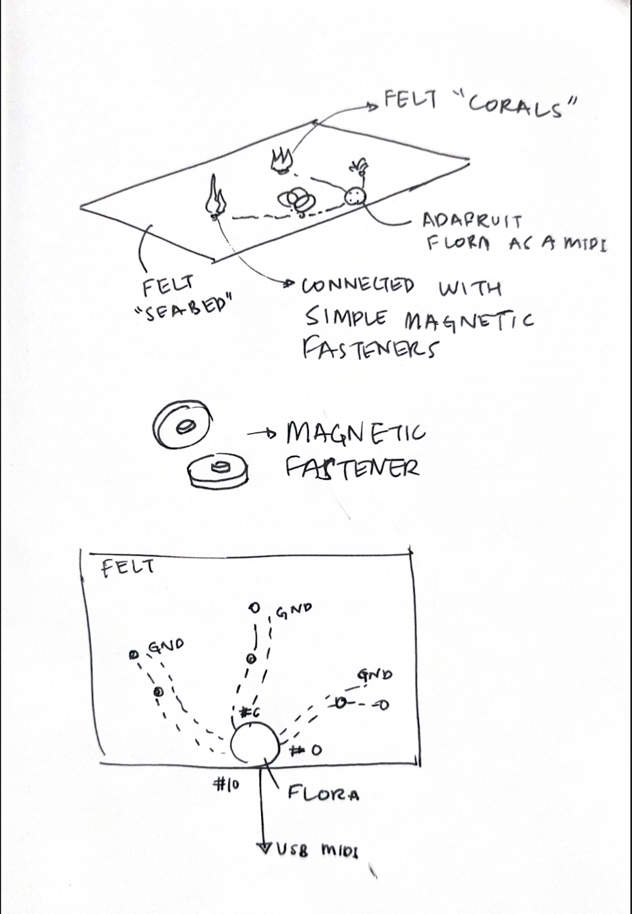

# Building a felt MIDI that looks like an ocean

## Steps to follow: 

1. Run the python file `flora_midi_bridge.py` in your terminal so that flora board is recognised as a MIDI
2. You can use the buttons of the corals as MIDI buttons
   
## Diagram:

## Documentation:

